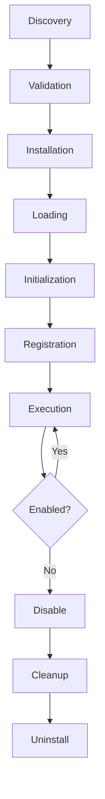

# Marathon Plugin Architecture

This document provides a comprehensive overview of the Marathon plugin system, a foundational architecture that enables extensible functionality through a secure and managed plugin ecosystem.

## Architecture Overview

The Marathon plugin system is designed with security, performance, and extensibility in mind. It provides a comprehensive framework for developing, distributing, and managing plugins that extend Marathon's capabilities.

### Core Components

```
src/plugins/
├── core/                          # Core plugin system
│   ├── plugin_api.zig            # Plugin API interface and utilities
│   ├── plugin_manifest.zig       # Manifest parsing and validation
│   ├── plugin_registry.zig       # Plugin discovery and registration
│   ├── plugin_manager.zig        # Complete lifecycle management
│   ├── event_system.zig          # Hook-based event system
│   ├── security.zig              # Security validation and sandboxing
│   └── root.zig                  # Module exports
├── cli/                          # CLI integration
│   └── plugin_cli.zig           # Plugin CLI commands
├── examples/                     # Example plugins
│   └── hello-world/             # Reference implementation
├── installed/                    # User-installed plugins
├── docs/                        # Documentation
│   └── plugin-development.md   # Plugin development guide
└── tests/                       # Comprehensive tests
    └── plugin_system_test.zig  # Integration tests
```

## Key Features

### 🔐 Security-First Design

- **Permission System**: Fine-grained permissions (task_read, network, filesystem, etc.)
- **Plugin Sandboxing**: Isolated execution environments with resource limits
- **Digital Signatures**: Support for signed plugins (future enhancement)
- **Validation Pipeline**: Comprehensive manifest and code validation
- **Dangerous Pattern Detection**: Automatic detection of suspicious code patterns

### 🚀 Hot Loading & Management

- **Dynamic Discovery**: Automatic plugin discovery from multiple search paths
- **Hot Loading**: Load plugins without system restart
- **Hot Reloading**: Update plugins without downtime (future enhancement)
- **Lifecycle Management**: Complete install/enable/disable/uninstall workflow
- **Dependency Resolution**: Automatic dependency management and loading order

### 🎯 Event-Driven Architecture

- **Hook System**: Pre/post hooks for task execution, user auth, configuration
- **Priority-Based Execution**: Configurable hook execution order
- **Chain Control**: Plugins can control whether subsequent hooks execute
- **Event History**: Comprehensive logging and debugging of hook execution
- **Performance Monitoring**: Track hook execution times and success rates

### 🛠 Developer Experience

- **Rich API**: Comprehensive plugin API with utilities and helpers
- **Type Safety**: Full Zig type safety for plugin development
- **Testing Framework**: Built-in testing utilities and patterns
- **Documentation**: Extensive documentation and examples
- **CLI Integration**: Seamless CLI command integration

## Plugin Lifecycle



### 1. Discovery Phase
- Scan configured plugin directories
- Parse `plugin.json` manifest files
- Validate basic manifest structure
- Register discovered plugins

### 2. Validation Phase
- Comprehensive manifest validation
- Security policy enforcement
- Dependency verification
- Permission analysis
- Code pattern scanning

### 3. Installation Phase
- Copy plugin files to managed location
- Verify file integrity and signatures
- Create plugin registry entry
- Fire installation hooks

### 4. Loading Phase
- Dynamic library loading (future)
- Module initialization
- Memory allocation and sandbox setup
- Interface validation

### 5. Initialization Phase
- Call plugin init function
- Load configuration
- Setup plugin state
- Register for required hooks

### 6. Registration Phase
- Subscribe to event hooks
- Register CLI commands
- Update plugin status to 'enabled'
- Fire post-initialization hooks

### 7. Execution Phase
- Respond to hook events
- Execute CLI commands
- Maintain plugin state
- Handle errors gracefully

## Security Model

### Permission System

Marathon's permission system provides fine-grained access control:

```zig
pub const Permission = enum {
    task_read,        // Read task data
    task_write,       // Modify task data
    user_auth,        // Access authentication data
    network,          // Network access
    filesystem,       // File system access
    env_vars,         // Environment variable access
    exec,             // Execute system commands
};
```

### Security Policies

```zig
pub const SecurityPolicy = struct {
    require_signatures: bool = false,
    allow_unsigned_dev: bool = true,
    max_plugin_size: usize = 10 * 1024 * 1024, // 10MB
    allowed_extensions: []const []const u8 = &.{".zig", ".json", ".md"},
    dangerous_permission_combos: []const []const Permission = &.{
        &.{ .exec, .filesystem },  // Dangerous combination
    },
};
```

### Sandboxing

Each plugin runs in a controlled environment:

```zig
pub const PluginSandbox = struct {
    resource_limits: ResourceLimits,
    current_usage: ResourceUsage,
    permissions: []const Permission,
    
    pub const ResourceLimits = struct {
        max_memory: usize = 64 * 1024 * 1024,     // 64MB
        max_cpu_time_ms: u64 = 10000,             // 10 seconds
        max_network_connections: u32 = 10,
        max_file_descriptors: u32 = 20,
    };
};
```

## Event System

### Available Hooks

```zig
pub const HookType = enum {
    pre_task_submit,      // Before task submission
    post_task_submit,     // After task submission
    pre_task_execute,     // Before task execution
    post_task_execute,    // After task execution
    user_auth,            // During authentication
    user_authz,           // During authorization
    cli_command,          // Custom CLI commands
    config_validate,      // Configuration validation
    plugin_install,       // Plugin installation
    plugin_uninstall,     // Plugin removal
};
```

### Hook Execution

Hooks execute in priority order with configurable behavior:

```zig
pub const HookResult = struct {
    success: bool,                // Hook execution success
    message: ?[]const u8,         // Optional message
    continue_chain: bool = true,  // Continue executing other hooks
    result_data: ?[]const u8,     // Optional result data
};
```

### Event History

The system maintains comprehensive event logs for debugging:

```zig
const EventRecord = struct {
    timestamp: i64,
    hook_type: HookType,
    plugin_name: ?[]const u8,
    data: ?[]const u8,
    success: bool,
    duration_ns: u64,
    result_message: ?[]const u8,
};
```

## CLI Integration

### Plugin Management Commands

```bash
# List all plugins
marathon plugin list [--status <status>]

# Install plugins
marathon plugin install <name|path>

# Manage plugin state
marathon plugin enable <name>
marathon plugin disable <name>
marathon plugin uninstall <name>

# Plugin information
marathon plugin info <name>
marathon plugin refresh

# Execute plugin commands
marathon plugin run <plugin> <command> [args...]
```

### Example Usage

```bash
# Install and use the hello-world plugin
$ marathon plugin install hello-world
✅ Plugin 'hello-world' installed successfully

$ marathon plugin enable hello-world
✅ Plugin 'hello-world' enabled successfully

$ marathon plugin run hello-world hello
Hello, World!

$ marathon plugin run hello-world greet Marathon
Hello, Marathon! Greetings from the hello-world plugin.

$ marathon plugin list
Plugins:
=========
Name                 Version    Status       Description
----                 -------    ------       -----------
hello-world          1.0.0      ✅ enabled   A simple hello world plugin

Summary: 1 total, 1 enabled, 0 disabled, 0 errors
```

## Development Guide

### Creating a Plugin

1. **Create Plugin Directory**:
   ```bash
   mkdir src/plugins/examples/my-plugin
   cd src/plugins/examples/my-plugin
   ```

2. **Create Manifest** (`plugin.json`):
   ```json
   {
     "name": "my-plugin",
     "version": "1.0.0",
     "description": "My awesome plugin",
     "author": "Your Name",
     "api_version": "1.0.0",
     "permissions": ["task_read"],
     "hooks": ["post_task_execute"],
     "commands": ["my-command"]
   }
   ```

3. **Implement Plugin** (`plugin.zig`):
   ```zig
   const std = @import("std");
   const plugin_core = @import("../../core/root.zig");
   
   // Plugin implementation...
   pub const plugin_interface = plugin_core.PluginAPI.Interface{
       .manifest = manifest,
       .init = init,
       .deinit = deinit,
       .hook = hook,
       .command = command,
   };
   ```

4. **Test Plugin**:
   ```bash
   zig test src/plugins/examples/my-plugin/plugin.zig
   marathon plugin install my-plugin
   marathon plugin enable my-plugin
   marathon plugin run my-plugin my-command
   ```

### API Reference

#### Core Types

- `Context`: Plugin execution context with allocator and permissions
- `HookResult`: Return type for plugin operations
- `Manifest`: Plugin metadata and configuration
- `Permission`: Security permission enumeration
- `HookType`: Available system hooks

#### Utilities

- `plugin_core.utils.log()`: Structured logging
- `plugin_core.utils.hasPermission()`: Permission checking
- `plugin_core.utils.success()`: Create success result
- `plugin_core.utils.failure()`: Create error result

### Best Practices

1. **Security**: Request minimal permissions, validate all inputs
2. **Memory Management**: Use provided allocator, clean up resources
3. **Error Handling**: Handle all errors gracefully, provide meaningful messages
4. **Testing**: Include comprehensive tests for all functionality
5. **Documentation**: Document all public functions and configurations

## Testing

### Running Tests

```bash
# Run all tests
zig build test

# Run plugin-specific tests only
zig build test-plugins

# Test specific plugin
zig test src/plugins/examples/hello-world/plugin.zig

# Integration test
zig test src/plugins/tests/plugin_system_test.zig
```

### Test Coverage

The plugin system includes:
- Unit tests for all core components
- Integration tests for complete workflows
- Example plugin tests demonstrating patterns
- Security validation tests
- Performance benchmarks (future)

## Performance Considerations

### Resource Management

- **Memory**: Plugins are limited to 64MB by default
- **CPU**: Hook execution timeouts prevent runaway plugins
- **I/O**: File descriptor and network connection limits
- **Disk**: Plugin size limits and file count restrictions

### Optimization Strategies

- **Lazy Loading**: Plugins are loaded only when needed
- **Hook Caching**: Frequently used hooks are cached for performance
- **Batch Operations**: Multiple hooks can be batched for efficiency
- **Resource Pooling**: Shared resources for common operations

### Monitoring

- Hook execution times and success rates
- Resource usage per plugin
- Error rates and patterns
- Performance impact on core system

## Deployment

### Development Environment

1. Place plugins in `src/plugins/examples/`
2. Use `marathon plugin refresh` to discover changes
3. Test with `marathon plugin install <local-path>`

### Production Environment

1. Package plugins as archives with manifests
2. Distribute via URL or package registry
3. Install with `marathon plugin install <url>`
4. Enable with appropriate security policies

### Distribution Best Practices

- Include comprehensive README and documentation
- Provide configuration examples and templates
- Include tests and validation scripts
- Use semantic versioning
- Sign plugins for security (future)

## Future Enhancements

### Planned Features

- **Remote Plugin Registry**: Central repository for plugin discovery
- **Plugin Marketplace**: UI for browsing and installing plugins
- **Hot Reloading**: Update plugins without system restart
- **Advanced Sandboxing**: WebAssembly or container-based isolation
- **Plugin Dependencies**: Complex dependency resolution and management
- **Performance Monitoring**: Real-time plugin performance metrics
- **Plugin Templates**: Code generators for common plugin patterns

### API Evolution

- Backwards compatibility guarantees
- Versioned API contracts
- Migration tools for plugin updates
- Deprecation warnings and upgrade paths

## Contributing

### Plugin Contributions

1. Follow the plugin development guide
2. Include comprehensive tests and documentation
3. Submit for security review
4. Add to examples directory with MIT license

### Core System Contributions

1. Discuss changes in GitHub issues first
2. Include tests for all new functionality
3. Update documentation and examples
4. Follow existing code style and patterns

## License

The Marathon Plugin System is licensed under MIT License. See [LICENSE](LICENSE) for details.

## Support and Resources

### Documentation

- [Plugin Development Guide](src/plugins/docs/plugin-development.md)
- [API Reference](src/plugins/core/plugin_api.zig)
- [Example Plugins](src/plugins/examples/)
- [Test Patterns](src/plugins/tests/)

### Community

- GitHub Issues for bug reports and feature requests
- Discussions for questions and community support
- Wiki for community-contributed guides and examples

### Getting Help

1. Check the documentation and examples first
2. Search existing GitHub issues
3. Create a new issue with detailed information
4. Join community discussions for general questions

---

The Marathon Plugin System provides a robust, secure, and extensible foundation for enhancing Marathon's capabilities. Whether you're building simple automation plugins or complex system integrations, the plugin system provides the tools and safeguards needed for production deployments.